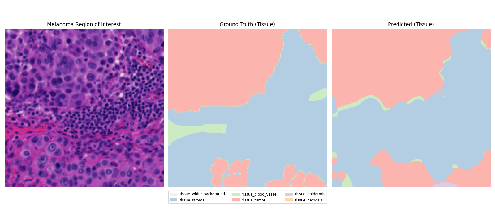
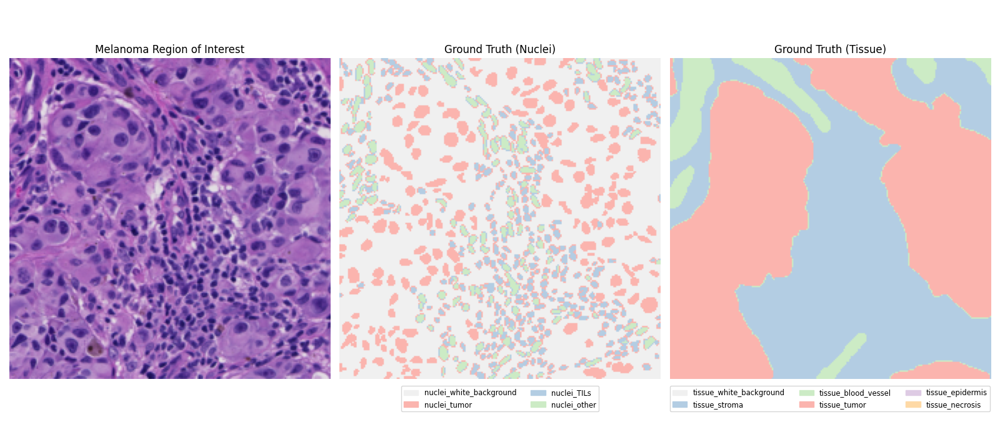

<!-- Improved compatibility of back to top link: See: https://github.com/othneildrew/Best-README-Template/pull/73 -->
<a id="readme-top"></a>
<!--
*** Thanks for checking out the Best-README-Template. If you have a suggestion
*** that would make this better, please fork the repo and create a pull request
*** or simply open an issue with the tag "enhancement".
*** Don't forget to give the project a star!
*** Thanks again! Now go create something AMAZING! :D
-->


<!-- PROJECT SHIELDS -->
<!--
*** I'm using markdown "reference style" links for readability.
*** Reference links are enclosed in brackets [ ] instead of parentheses ( ).
*** See the bottom of this document for the declaration of the reference variables
*** for contributors-url, forks-url, etc. This is an optional, concise syntax you may use.
*** https://www.markdownguide.org/basic-syntax/#reference-style-links
-->
[![MIT License][license-shield]][license-url]
[![LinkedIn][linkedin-shield]][linkedin-url]


<!-- PROJECT LOGO -->
<br />
<div align="center">
  <a href="https://github.com/othneildrew/Best-README-Template">
    
  </a>

  <h3 align="center">PUMA Grand Challenge<br> & <br> Tissue & Nuclei Segmentation</h3>

  <p align="center">
    <br />
    <a href="https://git.tu-berlin.de/cederic/attdmil/-/issues">Report Bug</a>
    ·
    <a href="https://git.tu-berlin.de/cederic/attdmil/-/issues">Request Feature</a>
  </p>
</div>


<!-- TABLE OF CONTENTS -->
<details>
  <summary>Table of Contents</summary>
  <ol>
    <li>
      <a href="#about-the-project">About The Project</a>
      </ul>
    </li>
    <li>
      <a href="#getting-started">Getting Started</a>
      <ul>
        <li><a href="#installation">Installation</a></li>
        <li><a href="#dataset-curation">Dataset curation</a></li>
        <li><a href="#model-training">Model Training</a></li>
      </ul>
    </li>
    <li><a href="#usage">Usage</a></li>
    <li><a href="#license">License</a></li>
    <li><a href="#contact">Contact</a></li>
    <li><a href="#acknowledgments">Acknowledgments</a></li>
  </ol>
</details>


<!-- ABOUT THE PROJECT -->
## About The Project

This project was developed as part of the PUMA Grand Challenge during the Seminar on AI for Biomedical Applications at TU Berlin, under the supervision of Prof. Jadaun. The goal of the project is to provide a deep learning-based solution for segmenting nuclei and tissue regions in histopathology images.

The model leverages a foundation transformer-based architecture for feature extraction and supports two modes: nuclei segmentation and tissue segmentation. It is designed to address challenges in histopathological analysis, such as small dataset sizes and the need for accurate delineation of fine-grained structures like nuclei.

This repository contains the implementation of the pipeline, including training, validation, and evaluation scripts, as well as preconfigured settings for hyperparameter optimization using Weights and Biases. The work aims to advance automated histopathological segmentation and contribute to research in biomedical image analysis.

<p align="right">(<a href="#readme-top">back to top</a>)</p>


<!-- GETTING STARTED -->
## Getting Started

To get a local copy and replicate our experiments follow these simple steps. 

### Installation

* clone the repo
   ```sh
   git clone https://github.com/cederican/PUMA.git
   ```

### Dataset curation

* to inspect the Histo dataset run 
   ```sh
   python ./puma/src/dataset/HistoDataset.py
   ```

### Model Training

* for training just run
   ```sh
   python ./puma/src/model/histo_train.py
   ```

* create a Weights and Biases account to be able to execute the implemented grid search properly
   ```sh
   https://wandb.ai/site/
   ```

* you can define a specific train config in train.py
   ```sh
   sweep_config = {
        'method': 'grid',
        'metric': {
            'name': 'val/dice',
            'goal': 'maximize' 
            },
        'parameters': {
            'lr': {
                'values': [1e-4, 1e-5]
            },
            
            'weight_decay': {
                'values': [1e-3]
            },
            
            'batch_size': {
                'values': [16]    
            },
            'dropout': {
                'values': [0.2, 0.5]
            },
            'mode': {
                'values': ['tissue', 'nuclei1']
            },
        }
    }
   ```

<p align="right">(<a href="#readme-top">back to top</a>)</p>


<!-- USAGE EXAMPLES -->
## Usage

The proposed model enables both nuclei and tissue segmentation in histopathology images, providing flexibility for analyzing different structures within the same framework. It can be adapted to segment either nuclei or tissue by switching modes, making it a versatile tool for diverse histological tasks such as identifying cellular features or larger tissue regions.



<p align="right">(<a href="#readme-top">back to top</a>)</p>


<!-- LICENSE -->
## License

Distributed under the MIT License. See `LICENSE.txt` for more information.

<p align="right">(<a href="#readme-top">back to top</a>)</p>


<!-- CONTACT -->
## Contact

* Cederic Aßmann - cederic.assmann@campus.tu-berlin.de
* Carmen Maldonado - carmen25mmo@gmail.com
* Samuel Domdey - samuel.domdey@gmail.com


<p align="right">(<a href="#readme-top">back to top</a>)</p>


<!-- ACKNOWLEDGMENTS -->
## Acknowledgments

Helpful libraries and papers used in the project

* [WandB](https://wandb.ai/site)
* [CTranspath foundation model](https://github.com/Xiyue-Wang/TransPath)


<p align="right">(<a href="#readme-top">back to top</a>)</p>


<!-- MARKDOWN LINKS & IMAGES -->
<!-- https://www.markdownguide.org/basic-syntax/#reference-style-links -->
[license-shield]: https://img.shields.io/github/license/othneildrew/Best-README-Template.svg?style=for-the-badge
[license-url]: LICENSE.txt
[linkedin-shield]: https://img.shields.io/badge/-LinkedIn-black.svg?style=for-the-badge&logo=linkedin&colorB=555
[linkedin-url]: https://www.linkedin.com/in/cederic-aßmann-41904322b/